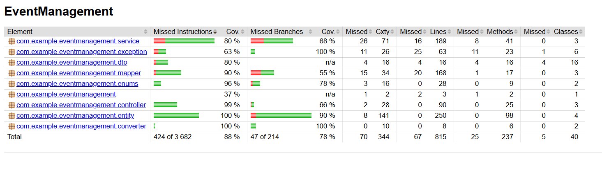
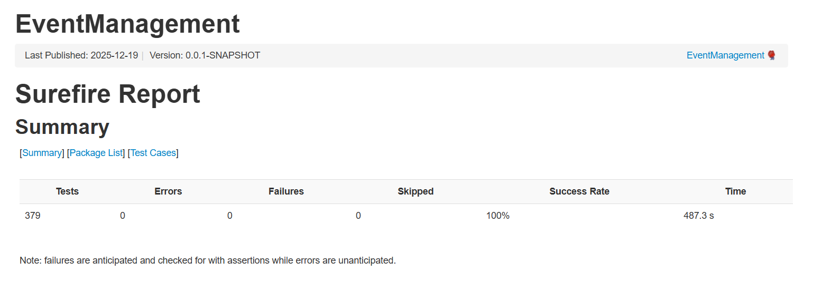

# Система управления мероприятиями

## Технологический стек

* **Java 21**
* **Spring Boot 3.5.7** — основной фреймворк для разработки приложения
* **Spring Data JPA** — для работы с базой данных PostgreSQL
* **PostgreSQL** — база данных
* **MapStruct** — для маппинга DTO и сущностей
* **JUnit 5** — для тестирования
* **Mockito** — для мокирования в тестах
* **Testcontainers** — для тестирования с использованием контейнера PostgreSQL
* **Maven** — для сборки проекта и управления зависимостями
* **Docker** — для контейнеризации приложения

## Обзор

Это система бронирования билетов, разработанная с использованием Java Spring. Приложение позволяет пользователям бронировать билеты на различные мероприятия, управлять информацией о клиентах и отслеживать статус бронирования. Система поддерживает RESTful API для управления клиентами и мероприятиями, предоставляя конечные точки для просмотра, создания, обновления и удаления клиентов и мероприятий, а также управления бронированием билетов.

Это мой первый проект на Java Spring, и он включает использование Spring Boot, JPA для работы с данными и PostgreSQL в качестве базы данных.

### Функции

* **Управление клиентами**: Просмотр, создание, обновление и удаление клиентов. Клиенты идентифицируются по номеру паспорта, телефону и электронной почте.
* **Управление мероприятиями**: Создание, обновление и удаление мероприятий, включая статистику мероприятия и статус бронирования.
* **Бронирование билетов**: Управление бронированием билетов, подтверждение или отмена бронирования.
* **Валидация данных**: Валидация входящих данных с использованием аннотаций Java Bean Validation.

## Покрытие тестами

Система имеет более 80% покрытия тестами.

### Отчеты по тестам

Ниже приведены отчеты Jacoco и Surefire с подробностями о покрытии и результатах тестирования:

* Отчет Jacoco о покрытии
  
* Отчет Surefire
  


## Docker Setup

### Требования

Убедитесь, что у вас установлены следующие программы:

* Docker
* Docker Compose

### Запуск приложения

1. **Сборка Docker-образа приложения**:
   В каталоге проекта выполните следующую команду для сборки Docker-образа приложения:

   ```bash
   docker-compose build
   ```

2. **Запуск приложения с помощью Docker Compose**:
   Используйте следующую команду для запуска приложения вместе с контейнером PostgreSQL:

   ```bash
   docker-compose up
   ```

   Приложение будет доступно по адресу [http://localhost:8080](http://localhost:8080).

### База данных

Система использует PostgreSQL в качестве базы данных. Детали подключения указаны в файле `docker-compose.yml`:

* **URL базы данных**: `jdbc:postgresql://db:5432/event_management_db`
* **Имя пользователя базы данных**: `new_user`
* **Пароль базы данных**: `new_password`

### Дополнительные замечания

* Для тестирования используется **Testcontainers**, что позволяет запускать тесты в контейнеризированном экземпляре PostgreSQL, чтобы убедиться в работоспособности приложения с реальной базой данных.
* Проект включает юнит-тесты и интеграционные тесты, а также валидацию для обеспечения целостности данных.

## Как запустить локально

Чтобы запустить приложение локально без Docker, убедитесь, что у вас установлены Java 21 и Maven.

1. Клонируйте репозиторий.
2. Выполните команду `mvn clean package`, чтобы собрать приложение.
3. Запустите приложение с помощью команды `mvn spring-boot:run`.
4. Приложение будет доступно по адресу [http://localhost:8080](http://localhost:8080).
